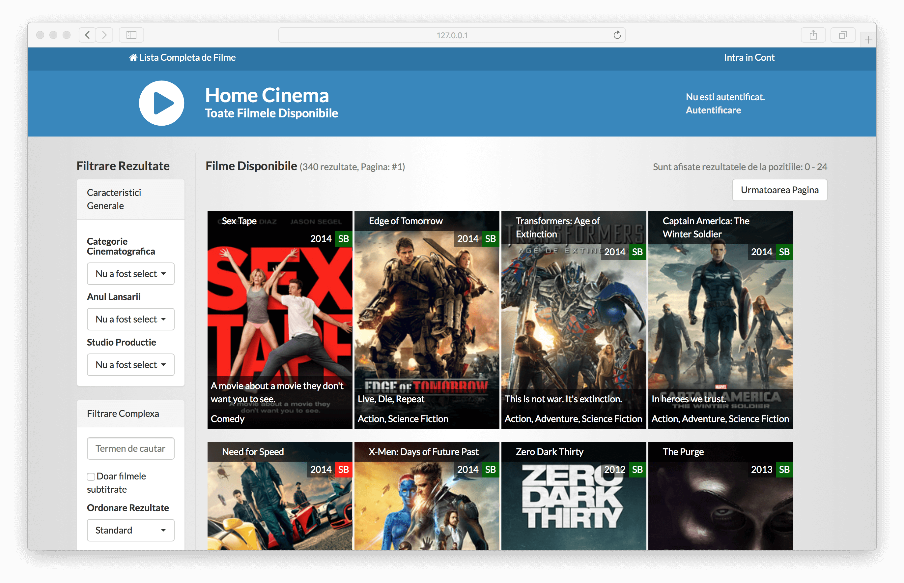

# HomeCloud (2014)
This is just a simple application created over a weekend to list and browse 
a fictional movie collection at that time, in a style very familiar with users of online streaming portals. 

A fun site project using Django, Python and bash. It also integrated with multiple API providers to load information,
cover images and trailer videos from only the file name.



## Running
You can simply run the website using Docker. It will spawn three machines:

* mariadb (MariaDB 10.3; private net)
* proxy (NGINX; private net + public net)
* worker (Python 2.7 with uswgi; private net)

Before you begin, make sure to create the local secrets using the included utility:

```
cd $GIT_ROOT
/bin/bash ./docs/generate-secrets.sh
```

Once ready, you can bring the services up with:

```
docker-compose -f docker-compose.yml build
docker-compose -f docker-compose.yml up
```

Make sure the following paths are allowed as mount points by Docker:

```
./machines
./runtime
./src
```

Author & License
================
Created in 2014 by Narcis. Licensed under MIT. Docker added in 2018.
